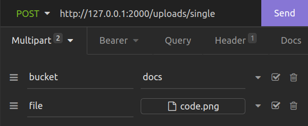

# File Upload Service

Implement file upload service using **nginx** + **minio** + **nestjs**.
**Without any buffering.**

## Instaliation

Install [Docker and docker-compose](https://www.docker.com/) .

## Start

At the root of the project, run:

```bash
docker-compose build
# and
docker-compose up
```


#### Usage Example 



